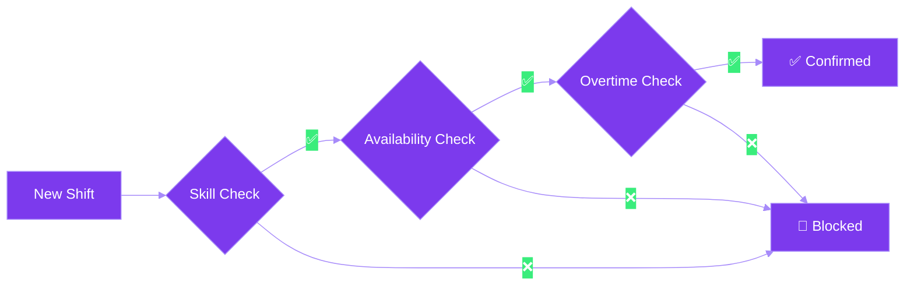
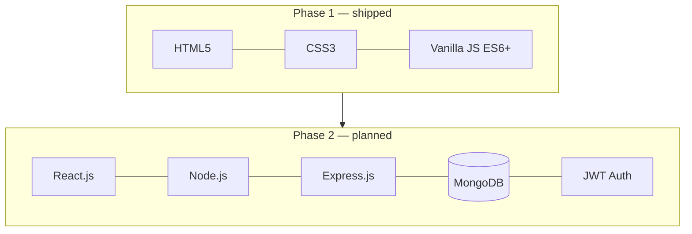

<p align="center">
  
</p>

<p align="center">
  
</p>

<p align="center">
  
  
  
  
  
</p>

<br>

## 📖 Introduction

**SmartShift** is a workforce scheduling platform built to replace manual, spreadsheet-based rostering. Store managers and café teams get conflict-free, automated weekly schedules — backed by a lightweight client-side validation engine that catches problems before a shift is ever confirmed.

Built entirely using **HTML5, CSS3, and JavaScript**, Phase 1 demonstrates responsive design, clean modular components, and polished micro-animations — no frameworks, no backend, yet.

<br>

## 🌫️ The Problem

Most small teams still schedule shifts using manual spreadsheets and WhatsApp messages — a process that quietly breaks down as the team grows.

| Manual method | What goes wrong |
|---|---|
| 📊 **Manual spreadsheets** | Hours are tracked by hand, so it's easy to miss when an employee has been assigned past their contracted weekly limit — leading to unnoticed **overtime violations**. |
| 💬 **WhatsApp messages** | Availability and shift swaps get buried in chat threads, leaving managers with **no central visibility** into who is actually free to work. |

SmartShift replaces both of these with a single, structured system — so scheduling decisions are based on real data, not scattered messages.

<br>

## 🧠 Smart Validation Engine



> **Phase 1:** these checks are visually demonstrated on the landing page. Live backend validation ships in Phase 2.

<br>

## ✨ Key Features

- 🗂️ **Employee Availability** — staff submit preferred/unavailable weekly slots
- ✅ **Smart Validation** — automated skill, availability, and overtime checks
- 📋 **Shift Management** — managers assign shifts against role requirements
- ⏱️ **Weekly Hours Tracker** — employees track upcoming shifts and totals

<br>

## 🛠️ Tech Stack



No external frameworks, libraries, or backends are used in Phase 1.

<br>

## ▶️ Getting Started

```bash
git clone https://github.com/Nayana84-m/FSD_project.git
```

Open `index.html` — it launches instantly in any browser.

<br>

## 📁 Project Architecture

```
FSD_project/
├── assets/
├── css/
├── js/
├── .gitignore
├── HOW_TO_RUN.txt
├── LICENSE
├── README.md
└── index.html
```

<br>

## 🔮 Future Scope

- React.js frontend with Employee and Manager dashboards
- Node.js + Express.js REST API backend
- MongoDB for persistent storage of users, shifts, and availability
- JWT Authentication for secure multi-role login
- Live backend validation for all 3 smart checks

<br>

<p align="center">
  <sub>Phase 1 · CIE-1 · BSc Computer Science · Full Stack Development Course</sub>
</p>
